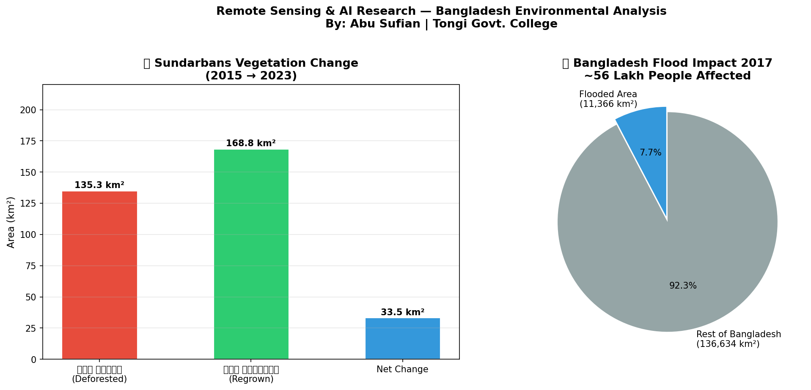

# 🛰️ Remote Sensing & AI — Bangladesh Environmental Analysis


## 📌 Overview

This project uses satellite imagery and AI to analyze two critical
environmental issues in Bangladesh:

1. **Deforestation Detection** in the Sundarbans (2015–2023)
2. **Flood Mapping** in Bangladesh using 2017 flood event data

**Tools used:** Google Earth Engine (JavaScript API for processing),
Python (geemap, matplotlib, pandas) for visualization and analysis,
and interactive HTML maps for sharing results.

---

## 🔬 Key Research Findings

### 🌳 Sundarbans Vegetation Change (2015 → 2023)
| Category | Area (km²) |
|---|---|
| Deforested Area | 135.28 km² |
| Regrown Area | 168.76 km² |
| **Net Change** | **+33.48 km²** |

> Sundarbans showed a net vegetation gain of 33.48 km²,
> suggesting active mangrove restoration efforts alongside
> localized deforestation pressure.

### 🌊 Bangladesh Flood Impact (2017)
| Metric | Value |
|---|---|
| Total Flooded Area | 11,366 km² |
| Percentage of Bangladesh | 7.7% |
| Estimated People Affected | ~5.6 Million |

---

## 🔬 Methodology (Technical Insights)

### Vegetation Analysis (NDVI)
- **Satellite:** Landsat 8 (30m resolution)
- **Logic:** Band 5 (Near-Infrared) and Band 4 (Red) were used
  to calculate canopy greenness using the formula:
  `NDVI = (NIR - Red) / (NIR + Red)`
- **Interpretation:** NDVI > 0.3 = healthy vegetation,
  NDVI < 0 = water or bare soil

### Flood Detection (SAR)
- **Satellite:** Sentinel-1 (Synthetic Aperture Radar)
- **Logic:** VV polarization was used because it is highly
  sensitive to water surfaces
- **Threshold:** -15 dB was applied to separate
  permanent water from flood water
- **Advantage:** SAR can see through clouds — critical
for flood monitoring in monsoon season

---

## 🗺️ Visualizations

### Research Findings Chart


### Interactive Maps
- 📂 [NDVI Change Map 2015→2023](ndvi_change_map.html)
- 📂 [Flood Detection Map 2017](flood_map_2017.html)

---

## 🛠️ Tools & Technologies

| Tool | Purpose |
|---|---|
| Google Earth Engine | Satellite image processing |
| Python 3.12 | Data analysis & visualization |
| geemap | Interactive map rendering |
| matplotlib | Research chart generation |
| Landsat 8 | Vegetation (NDVI) analysis |
| Sentinel-1 SAR | Flood detection via radar |
| HTML | Interactive map export |

---

## 📂 Project Structure
```
remote-sensing-bd/
│
├── 02-remote-sensing-bangladesh.ipynb  # Main Colab notebook
├── remote_sensing_findings.png         # Research chart
├── ndvi_change_map.html                # Interactive NDVI map
├── flood_map_2017.html                 # Interactive flood map
├── README.md
└── .gitignore
```

## 🚀 How to Run

1. Open Google Colab
2. Run `02-remote-sensing-bangladesh.ipynb`
3. Authenticate Google Earth Engine when prompted
4. Run all cells in order

---

## 👨‍🔬 Researcher

**Abu Sufian**
Class 11 | Tongi Govt. College, Gazipur, Bangladesh
Focus: AI Engineering & Environmental Research
GitHub: [@abusufian-dev](https://github.com/abusufian-dev)

---

## 🎯 Research Goal

This project is part of a 4-project AI research portfolio
aimed at securing a fully-funded scholarship in AI Engineering
at a top university in a globally recognized research university .
